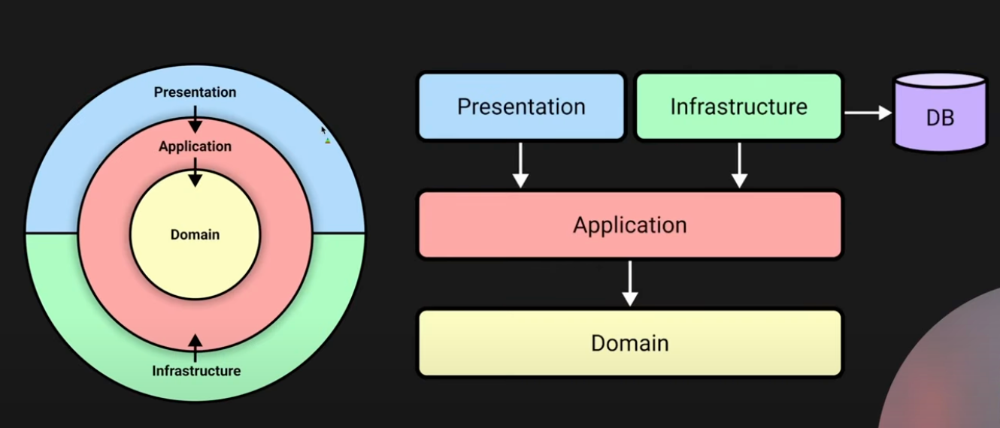

###### Assignment #3
## Clean backend

### Goals:
The goal of this assignment is to try an alternative for traditional Three Layered Architecture and try to implement a backend service using Clean Architecture approach.

### Basic Task
You need to implement a backend service (API) called _Reversi Online_ for playing a Reversi game (you can reuse your code from assignment #2). Requirements:
- user can authorize by his name and password, authentication for every request should be implemented via [Json Web Tokens](https://jwt.io/introduction);
- user can request a new game, specifying a wanted opponent - other player or cpu;
- in case if user decides to play with other player, he needs to wait while some other player requests a game, and after that start playing with that player;
- detailed statistics about total amount of games, wins and losses amount should be stored for every player with a possibility for them to check that data;
- users must have specified way to communicate during a game - it can be full chat or a predefined set of phrases;

### Implementation Order and Grading Policy
1. At first, you need to propose complete Http API (all methods, URIs, parameters etc.). After you API is approved, you can continue to next steps.
2. Implement a service around that API using Clean Architecture principles. Remember about persistence part, but do not implement any particular db integrations - for now your app can erase data between runs.
3. On this step, you will be provided a DB you should use. It can be SQL or NoSQL, so design your interfaces carefully - they need to support any kind of persistence.

### Grading policy
Maximum points: 10 (up to +10 additional)
- 1 point - approved Http API;
- 1 point - authentication via Json Web Tokens;
- 4 points - implementing a backend service according to Clean Architecture tasks;
- 2 points - implementing specified DB;
- 2 points - implementing an additional task.

You also can get additional points for:
- Implementing a client with GUI for your backend - up to +5 points. Client can be native or mobile application or separate website.
- Implementing a "hard" Reversi Ai using [MiniMax](https://en.wikipedia.org/wiki/Minimax) algorithm - up to +3 points.
- Implementing one more additional task with extension of your service - up to +2 points.

### Learning materials
- Clean Architecture book;
- [Introductory video](https://www.youtube.com/watch?v=1OLSE6tX71Y);
- [Lecture from 22.03](https://www.youtube.com/watch?v=tMNo79wvojs)

After this you can read other materials on the internet but be aware that you can find a lot of wrong arrows and ideas.

